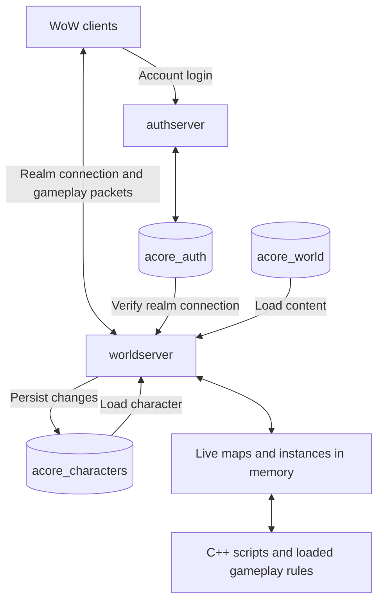
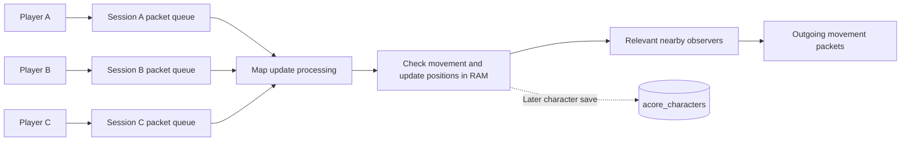

# Gameplay, databases, and concurrent movement

The worldserver runs live gameplay in memory. Databases supply content and persist progress;
ordinary movement, attacks, and spell casts do not query or write MySQL for every action.

## Database roles

- `acore_auth`: accounts, bans, realm information, and authentication/session data.
  The authserver handles account login; the worldserver also checks authentication on realm connection.
- `acore_world`: content definitions, including creatures, spawns, quests, loot tables, and data-driven rules.
  Much of this is loaded into memory. C++ scripts and client data files also supply gameplay behavior/data.
- `acore_characters`: persistent character state, inventory, quest progress, saved positions, guilds, and mail.
  Characters load at login; save paths persist subsequent changes.

These are logical MySQL databases and can share one MySQL server.

## Essential gameplay flows

- Login: authenticate account, load selected character, and add the player to a map.
- Movement: process/check movement packets, update position in memory, and relay to relevant nearby clients.
  Save paths persist position later; each movement is not a database update.
- Combat/spells: check conditions, run rules, update live health/auras/combat state, and send results.
  Persistent consequences are saved as appropriate; the running simulation is not fully serialized.
- Kill/loot: handle death, determine loot and eligibility, award items/money/XP and applicable quest credit.
  Content supplies loot rules; character storage persists acquired items and progress.
- Quests: loaded definitions govern requirements/rewards; per-character objective and completion state is persisted.
- Trade/mail/auctions: validate ownership and transfer assets. Related persistent writes use database transactions
  where implemented; inspect the specific operation before assuming its atomicity or save timing.
- Save/logout: persist character state. Autosaves, logout saves, and operation-specific saves have different timing.
  Unsaved changes can be lost in a crash.

## Many players moving together

Network input is queued by session. Update processing handles queued movement; apparent simultaneity comes from
rapidly processing many operations. Clients render movement between updates. Session packet filters determine
which processing context handles a packet; do not assume every opcode runs in map processing.

Map-update workers can process separate scheduled maps in parallel when configured. Adding workers does not
automatically distribute one crowded city's player updates across all cores. Movement visibility limits recipients,
but a crowded area still multiplies outgoing work: each moving player can have many observers. Processing or
network backlogs can cause lag even though ordinary movement is outside the immediate database write path.

Defaults observed in `src/server/apps/worldserver/worldserver.conf.dist` on 2026-09-05:

- `MapUpdate.Threads = 1`.
- `MapUpdateInterval = 10` milliseconds; this is a configured interval, not a guaranteed achieved rate.
- `PlayerSaveInterval = 900000` milliseconds (15 minutes); other save paths also apply.

Check the effective running configuration before using these defaults to explain a live server.

## Source anchors

- `src/server/apps/authserver/Server/AuthSession.cpp`: account authentication.
- `src/server/game/Server/WorldSocket.cpp`: realm authentication and incoming packet dispatch to sessions.
- `src/server/game/Server/WorldSession.cpp`: `QueuePacket`, `Update`, and packet filtering.
- `src/server/game/Handlers/CharacterHandler.cpp`: `LoginQueryHolder` and character login.
- `src/server/game/World/World.cpp`: content loading.
- `src/server/game/Maps/Map.cpp`: map session updates via `MapSessionFilter`.
- `src/server/game/Maps/MapMgr.cpp`: `MapMgr::Update`, worker scheduling, and waiting for completion.
- `src/server/game/Handlers/MovementHandler.cpp`: `HandleMovementOpcodes`, `HandleMoverRelocation`.
- `src/server/game/Entities/Player/PlayerStorage.cpp`: `SaveToDB`, transactional character/inventory/quest saves.
